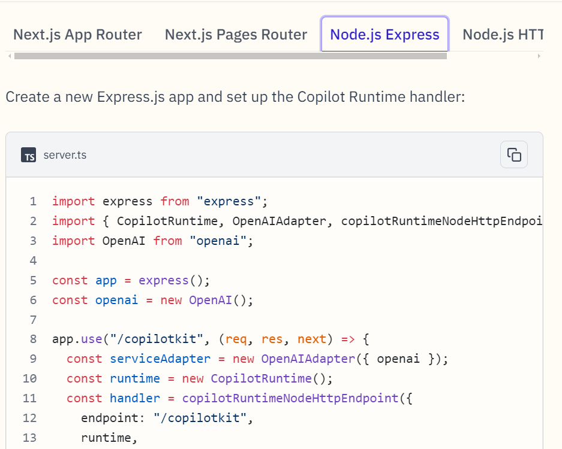

## Render deployment

    **backend Copliot Selfhost**
https://docs.copilotkit.ai/concepts/self-hosting



```
"use client";
 
import { CopilotKit } from "@copilotkit/react-core";
import { CopilotSidebar } from "@copilotkit/react-ui";
import "@copilotkit/react-ui/styles.css";
 
export default function RootLayout({children}) {
  return (
    <CopilotKit runtimeUrl="<copilot-runtime-url>">
      <CopilotSidebar>
        {children}
      </CopilotSidebar>
    </CopilotKit>
  );
}
```
## Vercel for React frontend
